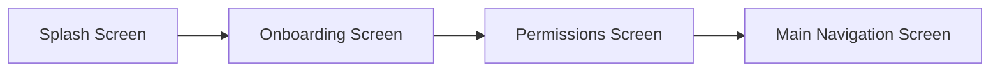
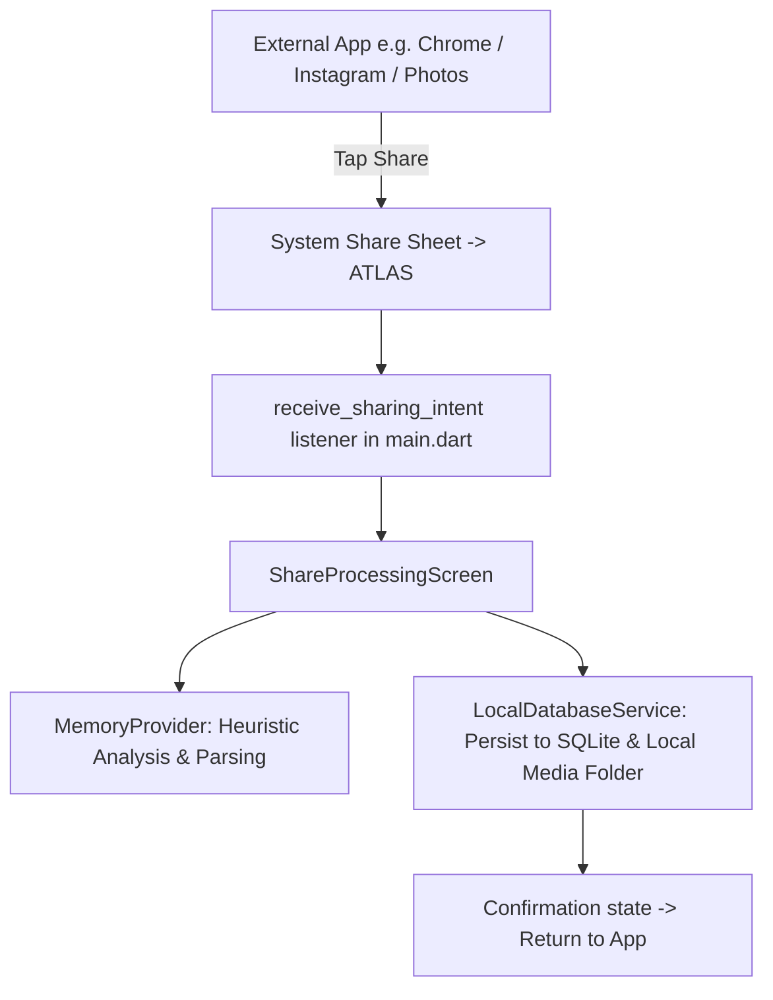

# ATLAS — Personal Memory OS
> **"Save Anything. Find Everything."**

---

## 1. Executive Summary & Product Vision
**Atlas** is an AI-augmented personal memory operating system built using **Flutter (Material 3)**. It is designed to act as an intelligent second brain that eliminates the friction of bookmarking, hoarding screenshots, saving recipe links, clipping code snippets, or keeping track of travel bookings.

Rather than acting like a passive file manager, Atlas actively extracts context, semantic meaning, and categories from saved content (via sharing intents, local photo gallery scanning, or manual entry) and offers visual exploration interfaces (a **3D Globe** and a **Constellation Star Universe**) alongside **Natural Language Semantic Search** and **Local-First Database & Cloud Synchronization**.

---

## 2. Technical Stack & Dependencies
* **Framework**: Flutter (Dart SDK `^3.12.2`), Material 3 design system.
* **Typography & Design**: Google Fonts (`Outfit`), custom HSL/palette color tokens in `AtlasColors`.
* **State Management**: `provider` (`ChangeNotifier` / `ChangeNotifierProvider`).
* **Local Database & Storage**:
  * `sqflite` & `sqflite_common_ffi`: High-performance embedded SQLite database engine with indexed columns (`category`, `isDeleted`, `isFavorite`, `isArchived`, `syncStatus`, `updatedAt`).
  * `path_provider` & `path`: Manages local file/database storage persistence for imported files and images.
  * `shared_preferences`: Persists user preferences and permission states.
* **Cloud Sync**:
  * `firebase_core`, `cloud_firestore`, `firebase_auth`: Offline-first synchronization pipeline syncing local SQLite data with Cloud Firestore.
* **Device Integrations & Media**:
  * `flutter_launcher_icons`: Multi-platform adaptive launcher icon generation from `assets/icons/app_logo.png`.
  * `receive_sharing_intent`: Captures text, URLs, images, videos, and files shared from external apps (warm & cold start).
  * `photo_manager`: Discovers and extracts real screenshots from the device photo library.
  * `intl`: Date, time, and currency formatting.

---

## 3. Project Directory & Architecture Map

```
Atlas/
├── assets/
│   └── icons/
│       └── app_logo.png               # High-res Brand icon (app launcher source)
├── pubspec.yaml                       # Dependencies & Flutter launcher icon config
├── lib/
│   ├── main.dart                      # App entry, intent listener, theme config
│   ├── models/
│   │   └── memory_item.dart           # MemoryItem (OCR text, structured entities), MemoryType, SyncStatus
│   ├── services/
│   │   ├── local_database_service.dart # SQLite DB helper (v2): CRUD, soft-delete, schema migrations
│   │   ├── ocr_service.dart           # On-device OCR text recognition & cleaner
│   │   ├── ai_intelligence_service.dart # AI Semantic Intelligence, 2-sentence summary & entity extraction
│   │   ├── url_metadata_service.dart  # OpenGraph metadata scraper & Reader Mode body extractor
│   │   └── firebase_sync_service.dart # Cloud Firestore sync engine & offline fallback
│   ├── providers/
│   │   └── memory_provider.dart       # Reactive state store, OCR/AI ingestion, triage & search
│   ├── theme/
│   │   └── app_theme.dart             # AtlasColors, AtlasTheme, custom shadows
│   └── screens/
│       ├── splash_screen.dart         # Pulsing branding splash animation
│       ├── onboarding_screen.dart     # Intro carousel: Save Anything from anywhere
│       ├── permissions_screen.dart    # Permission request & privacy disclosure
│       ├── main_navigation_screen.dart# Custom bottom capsule navbar + Floating Action Button (+)
│       ├── home_screen.dart           # Dashboard: Ask ATLAS, filters, triage, CRUD feed, drawer
│       ├── universe_screen.dart       # Dual-view: 3D Globe Explorer & Constellation Star Sky
│       ├── search_screen.dart         # Multi-field Semantic & OCR search interface
│       ├── detail_screen.dart         # Memory detail card: AI Understanding, Entity Cards, OCR Text, Full Image Viewer
│       ├── reader_mode_screen.dart    # Clean article Reader Mode (font scaler, themes, progress bar)
│       ├── edit_memory_sheet.dart     # Modal sheet to update title, category, tags, and notes
│       ├── needs_review_screen.dart   # Triage queue with AI confidence suggestions
│       ├── screenshot_review_screen.dart # Device gallery screenshot selector & importer
│       ├── add_memory_sheet.dart      # Bottom sheet modal for manual note/link creation
│       ├── profile_screen.dart        # Account metrics, cloud sync status, trash bin, export
│       └── share_processing_screen.dart # Animated loading radar for inbound shared media
```

---

## 4. Application Flow & User Journeys

### A. First-Time User Experience (FTUE)

1. **`SplashScreen`**: Displays pulsing Atlas circular branding logo for 3 seconds.
2. **`OnboardingScreen`**: Introduces value proposition (*"Save links, screenshots, ideas, or files into ATLAS from anywhere"*).
3. **`PermissionsScreen`**: Explains local-first privacy commitment and prompts for Photo Library access.
4. **`MainNavigationScreen`**: Unlocks the 4 main application tabs.

---

### B. Core Navigation (Main Tabs & Floating Hero FAB)
The app utilizes a floating pill navigation bar with 4 tabs and a center elevated Action Button:

| Tab Index | Screen | Icon | Purpose & Features |
| :--- | :--- | :--- | :--- |
| **0** | **Home** | `Icons.home_rounded` | Shows greeting, search bar, active filter pills (All, Favorites, Archived), triage banner, and recent memory feed with swipe/tap actions. |
| **1** | **Universe** | `Icons.language_rounded` | **3D Data World & Universe Explorer**: Interactive rotatable 3D projected sphere with glowing cyan atmosphere rim, category memory cluster nodes, dynamic speed controls, and a swipeable floating memory card deck. |
| **Center FAB** | **Add Memory** | `Icons.add_rounded` | Opens `AddMemorySheet` modal to paste notes/links and assign categories. |
| **2** | **Needs Review** | `Icons.move_to_inbox_rounded` | Triage screen for uncategorized or low-confidence incoming saves. Users tap category tags to classify them. |
| **3** | **Screenshots** | `Icons.image_rounded` | Photo Library inspector that surfaces un-saved screenshots ($N - \text{saved}$), enables multi-selection with an animated floating circular tick-badge button, and runs on-device OCR & AI Semantic Intelligence (naming, 2-sentence summary, smart tags, structured entities) upon saving. |

---

### C. Unit 1: Data Lifecycle & Persistence
```mermaid
graph TD
    UI[Screens / Modals] -->|CRUD Actions| Provider[MemoryProvider]
    Provider -->|Async Write/Query| SQLite[LocalDatabaseService (SQLite)]
    Provider -.->|Background Sync| Firebase[FirebaseSyncService (Firestore)]
    SQLite -->|Reactive Updates| UI
```
- **Creation**: Memories saved from Share Intent, Screenshot Importer, or `AddMemorySheet` are inserted directly into SQLite `memories` table.
- **Update**: Full editing of title, notes/content, tags, and category via `EditMemorySheet`.
- **Soft-Delete & Trash**: Deleted items marked `isDeleted = 1` and moved to Trash bin in `ProfileScreen` with full restore and empty-trash capabilities.
- **Favorites & Archive**: Fast indexing enables instant switching between active, favorite, and archived memory views.

---

### D. Inbound External Sharing Flow (System Share Sheet)


---

## 5. Development Roadmap Summary
- [x] **Unit 1: Robust Local Database & Full CRUD Engine** (Completed — SQLite embedded engine, full CRUD lifecycle, Trash bin, Favorites, Archive, Sync State, adaptive app icons).
- [x] **Unit 2: On-Device OCR & AI Semantic Intelligence** (Completed — On-device OCR extraction, AI semantic intelligence engine, structured domain entities, 2-sentence AI summaries, Clarify triage routing).
- [x] **Unit 3: Rich Web URL Previews & Reader Mode** (Completed — OpenGraph metadata scraping, distraction-free in-app Reader Mode, full-screen zoomable screenshot viewer).
- [x] **Unit 4: Universal Semantic & Full-Text Search (FTS5)** (Completed — Multi-field search, multi-dimensional type/date/category/favorite filters, voice search experience, recent search history, match highlighting).
- [x] **Unit 5: 3D Data World & Interactive Spatial Universe Explorer** (Completed — Orthographic 3D Data World projected sphere, Constellation Star Sky mode, cluster node beacons, interactive focus, synced floating card deck).
- [x] **Unit 6: PDF, Documents & Voice Memo Capture** (Completed — PDF/Document importer, voice memo recorder with live timer and soundwave visualizer, interactive audio player in DetailScreen).
- [ ] **Unit 7: Collections, Smart Albums & Bulk Organization** (Next: Custom collections/spaces, rule-based albums, bulk management).
- [ ] **Unit 8: Export, Encrypted Cloud Backup & Multi-Platform Sync**.
