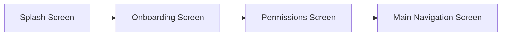

# ATLAS — Personal Memory OS
> **"Save Anything. Find Everything."**

---

## 1. Executive Summary & Product Vision
**Atlas** is an AI-augmented personal memory operating system built using **Flutter (Material 3)**. It is designed to act as an intelligent second brain that eliminates the friction of bookmarking, hoarding screenshots, saving recipe links, clipping code snippets, or keeping track of travel bookings.

Rather than acting like a passive file manager, Atlas actively extracts context, semantic meaning, and categories from saved content (via sharing intents, local photo gallery scanning, voice recordings, document imports, or manual entry) and offers visual exploration interfaces (a **3D Globe** and a **Constellation Star Universe**) alongside **Natural Language Semantic Search**, **Custom Collections / Spaces**, and **Local-First Database & Cloud Synchronization**.

---

## 2. Technical Stack & Dependencies
* **Framework**: Flutter (Dart SDK `^3.12.2`), Material 3 design system.
* **Typography & Design**: Google Fonts (`Outfit`), custom HSL/palette color tokens in `AtlasColors`.
* **State Management**: `provider` (`ChangeNotifier` / `ChangeNotifierProvider`).
* **Local Database & Storage**:
  * `sqflite` & `sqflite_common_ffi`: High-performance embedded SQLite database engine (v3) with tables `memories` and `collections`, plus indexed columns (`category`, `isDeleted`, `isFavorite`, `isArchived`, `syncStatus`, `updatedAt`).
  * `path_provider` & `path`: Manages local file/database storage persistence for imported files and images.
  * `shared_preferences`: Persists user preferences and permission states.
* **Cloud Sync**:
  * `firebase_core`, `cloud_firestore`, `firebase_auth`: Offline-first synchronization pipeline syncing local SQLite data with Cloud Firestore.
* **Device Integrations & Media**:
  * `flutter_launcher_icons`: Multi-platform adaptive launcher icon generation from `assets/icons/app_logo.png`.
  * `receive_sharing_intent`: Captures text, URLs, images, videos, and files shared from external apps (warm & cold start).
  * `photo_manager`: Discovers and extracts real screenshots from the device photo library.
  * `intl`: Date, time, and currency formatting.

---

## 3. Project Directory & Architecture Map

```
Atlas/
├── assets/
│   └── icons/
│       └── app_logo.png               # High-res Brand icon (app launcher source)
├── pubspec.yaml                       # Dependencies & Flutter launcher icon config
├── lib/
│   ├── main.dart                      # App entry, intent listener, theme config
│   ├── models/
│   │   ├── memory_item.dart           # MemoryItem (OCR text, structured entities), MemoryType, SyncStatus
│   │   └── collection_item.dart       # MemoryCollection (title, description, color, icon, itemIds, isSmart)
│   ├── services/
│   │   ├── local_database_service.dart # SQLite DB helper (v3): Memories + Collections CRUD, soft-delete, migrations
│   │   ├── ocr_service.dart           # On-device OCR text recognition & cleaner
│   │   ├── ai_intelligence_service.dart # AI Semantic Intelligence, 2-sentence summary & entity extraction
│   │   ├── url_metadata_service.dart  # OpenGraph metadata scraper & Reader Mode body extractor
│   │   └── firebase_sync_service.dart # Cloud Firestore sync engine & offline fallback
│   ├── providers/
│   │   └── memory_provider.dart       # Reactive state store, OCR/AI ingestion, collections, bulk actions & search
│   ├── theme/
│   │   └── app_theme.dart             # AtlasColors, AtlasTheme, custom shadows
│   └── screens/
│       ├── splash_screen.dart         # Pulsing branding splash animation
│       ├── onboarding_screen.dart     # Intro carousel: Save Anything from anywhere
│       ├── permissions_screen.dart    # Permission request & privacy disclosure
│       ├── main_navigation_screen.dart# Custom bottom capsule navbar + Floating Action Button (+)
│       ├── home_screen.dart           # Dashboard: Ask ATLAS, filters, bulk selection mode, recent memory feed
│       ├── collections_screen.dart    # Custom Collections & Dynamic Smart Albums grid + Collection Detail View
│       ├── universe_screen.dart       # 3D Data World Globe & Constellation Universe Explorer
│       ├── search_screen.dart         # Multi-field Semantic & OCR search interface with type filters
│       ├── detail_screen.dart         # Memory detail card: AI Understanding, Entity Cards, Audio Player, PDF View
│       ├── reader_mode_screen.dart    # Clean article Reader Mode (font scaler, themes, progress bar)
│       ├── edit_memory_sheet.dart     # Modal sheet to update title, category, tags, and notes
│       ├── needs_review_screen.dart   # Triage queue with AI confidence suggestions
│       ├── screenshot_review_screen.dart # Device gallery screenshot selector & importer
│       ├── add_memory_sheet.dart      # Multi-mode capture modal (Note/Link, Voice Memo, PDF/Doc)
│       ├── profile_screen.dart        # Account metrics, cloud sync status, trash bin, export
│       └── share_processing_screen.dart # Animated loading radar for inbound shared media
```

---

## 4. Application Flow & User Journeys

### A. First-Time User Experience (FTUE)

1. **`SplashScreen`**: Displays pulsing Atlas circular branding logo for 3 seconds.
2. **`OnboardingScreen`**: Introduces value proposition (*"Save links, screenshots, ideas, or files into ATLAS from anywhere"*).
3. **`PermissionsScreen`**: Explains local-first privacy commitment and prompts for Photo Library access.
4. **`MainNavigationScreen`**: Unlocks the 4 main application tabs.

---

### B. Core Navigation (Main Tabs & Floating Hero FAB)
The app utilizes a floating pill navigation bar with 4 tabs and a center elevated Action Button:

| Tab Index | Screen | Icon | Purpose & Features |
| :--- | :--- | :--- | :--- |
| **0** | **Home** | `Icons.home_rounded` | Dashboard with search trigger, filter pills, triage banner, recent memory feed, and **Multi-Select Bulk Mode** (batch delete, favorite, categorize, add to collection). |
| **1** | **Universe** | `Icons.language_rounded` | **3D Data World Explorer**: Interactive rotatable 3D projected sphere with category memory cluster nodes, speed controls, and synced floating memory card deck. |
| **Center FAB** | **Add Memory** | `Icons.add_rounded` | Opens `AddMemorySheet` with 3 capture modes: Note/Link, Voice Memo (live waveform & speech-to-text), and PDF/Document loader. |
| **2** | **Needs Review** | `Icons.move_to_inbox_rounded` | Triage screen for uncategorized or low-confidence incoming saves. Users tap category tags to classify them. |
| **3** | **Screenshots** | `Icons.image_rounded` | Photo Library inspector surfacing un-saved screenshots with floating tick badge and AI semantic extraction upon saving. |

---

### C. Collections & Bulk Organization Engine (Unit 7)
- **Custom Collections**: Users can create project boards (*"Japan Trip 2026"*, *"Startup Ideas"*) with custom accent colors and icons.
- **Smart Dynamic Albums**: Rule-based dynamic albums (*"Finance & Bills"*, *"Voice Notes & Audio"*, *"Culinary Recipes"*) that automatically group matching memories.
- **Multi-Select Mode**: Long-press on any card on the Home screen to batch favorite, batch categorize, batch add to collection, or batch delete items.

---

## 5. Development Roadmap Summary
- [x] **Unit 1: Robust Local Database & Full CRUD Engine** (Completed — SQLite embedded engine, full CRUD lifecycle, Trash bin, Favorites, Archive, Sync State, adaptive app icons).
- [x] **Unit 2: On-Device OCR & AI Semantic Intelligence** (Completed — On-device OCR extraction, AI semantic intelligence engine, structured domain entities, 2-sentence AI summaries, Clarify triage routing).
- [x] **Unit 3: Rich Web URL Previews & Reader Mode** (Completed — OpenGraph metadata scraping, distraction-free in-app Reader Mode, full-screen zoomable screenshot viewer).
- [x] **Unit 4: Universal Semantic & Full-Text Search (FTS5)** (Completed — Multi-field search, multi-dimensional type/date/category/favorite filters, voice search experience, recent search history, match highlighting).
- [x] **Unit 5: 3D Data World & Interactive Spatial Universe Explorer** (Completed & UI Locked — Orthographic 3D Data World projected sphere with cluster node beacons, interactive focus, synced floating card deck).
- [x] **Unit 6: PDF, Documents & Voice Memo Capture** (Completed — Multi-mode capture, voice recording with live timer, waveform visualizer, speech-to-text transcription, interactive audio player in DetailScreen).
- [x] **Unit 7: Collections, Smart Albums & Bulk Organization** (Completed — Custom spaces, smart rule-based albums, CollectionsScreen grid, Home multi-select bulk action bar, DetailScreen collection picker).
- [ ] **Unit 8: Export, Encrypted Cloud Backup & Multi-Platform Sync** (Next: JSON/Markdown export, encrypted local/cloud backup, biometric lock).
